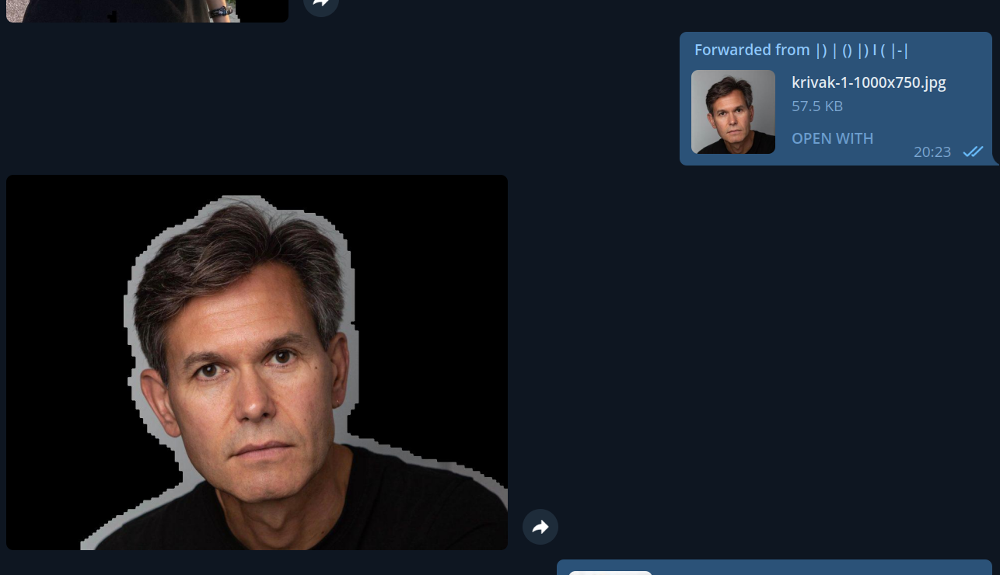
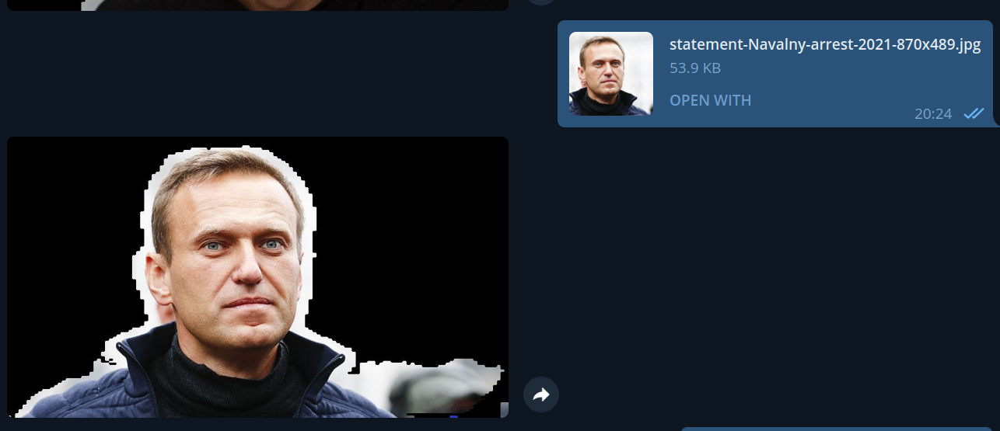
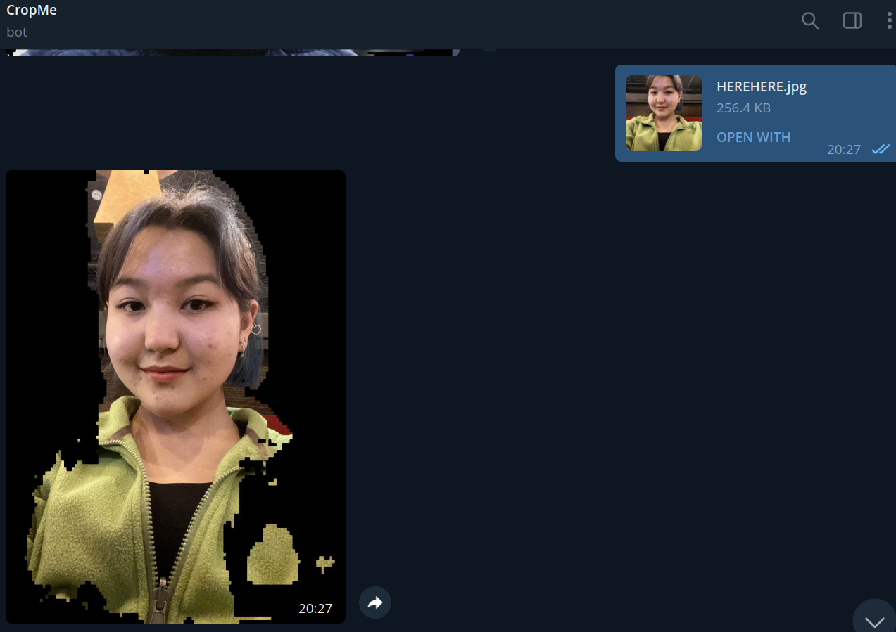
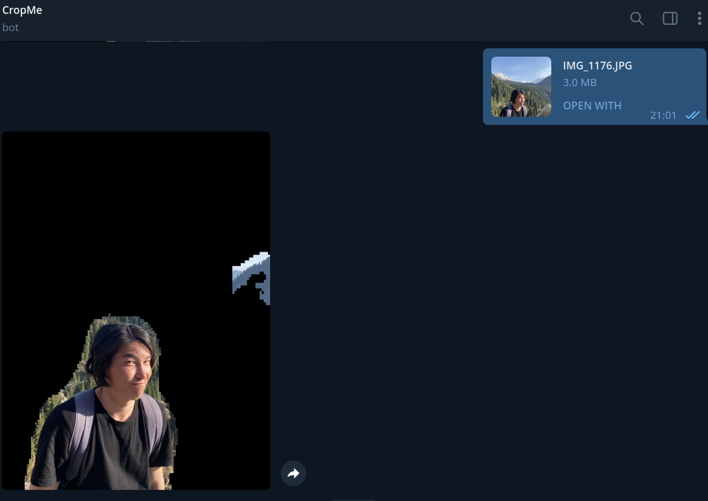

### Human crop bot

#### An image segmentation model which predict human mask in image and crop. In this project I used UNET model:

### Dataset upload from [kaggle](https://www.kaggle.com/datasets/tapakah68/supervisely-filtered-segmentation-person-dataset)

### Preprocced image and set to 128x128 resolution

### Create telegram bot with [Telegram Bot API](https://core.telegram.org/bots/api)

### Some results of model:

